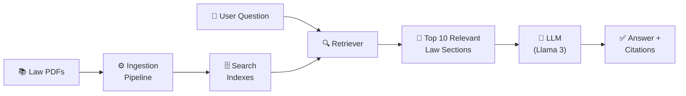
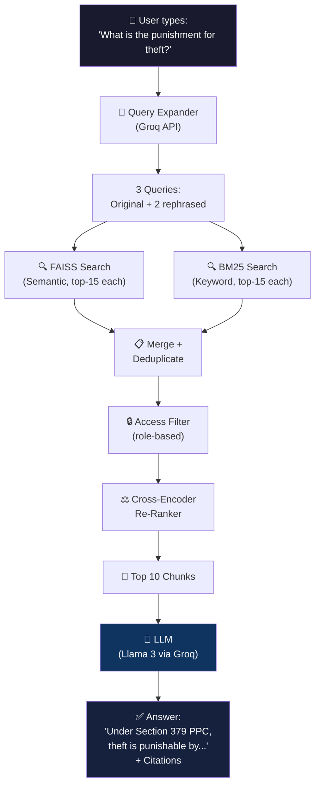

# PakLaw AI — Complete Beginner's Guide to Every Concept & Technology

> [!NOTE]
> This guide assumes **zero** prior experience. Every concept is explained from scratch with real-world analogies before diving into the technical details. Read it top-to-bottom — each section builds on the previous one.

---

## Table of Contents

1. [The Big Picture — What Are We Building?](#1-the-big-picture)
2. [The Core Idea — RAG (Retrieval-Augmented Generation)](#2-rag)
3. [Step 1: Getting Text Out of PDFs](#3-pdf-extraction)
4. [Step 2: Chunking — Breaking Text Into Pieces](#4-chunking)
5. [Step 3: Embeddings — Teaching Computers to Understand Meaning](#5-embeddings)
6. [Step 4: FAISS — The Semantic Search Engine](#6-faiss)
7. [Step 5: BM25 — The Keyword Search Engine](#7-bm25)
8. [Step 6: Hybrid Retrieval — Best of Both Worlds](#8-hybrid-retrieval)
9. [Step 7: Query Expansion — Asking the Question 3 Ways](#9-query-expansion)
10. [Step 8: Re-Ranking — The Quality Filter](#10-reranking)
11. [Step 9: The LLM — Generating the Final Answer](#11-llm)
12. [Step 10: Prompt Engineering — Controlling the AI](#12-prompt-engineering)
13. [Access Control — Who Can See What](#13-access-control)
14. [The UI — Streamlit](#14-streamlit)
15. [The Full Pipeline — How It All Connects](#15-full-pipeline)
16. [Technology Cheat Sheet](#16-cheat-sheet)
17. [Python Libraries You'll Use](#17-libraries)
18. [Key Vocabulary Glossary](#18-glossary)

---

## 1. The Big Picture — What Are We Building? {#1-the-big-picture}

### The Problem

Imagine you're a lawyer in Pakistan. You have hundreds of PDF documents — the Constitution, the Penal Code, Criminal Procedure, Family Laws, and more. A client asks:

> *"Can a woman file for divorce under Pakistani law? What are the grounds?"*

Right now, you'd have to:
1. Open multiple PDFs
2. Ctrl+F through each one
3. Read dozens of pages
4. Piece together an answer manually

This takes **hours**. And if you miss a relevant section, your legal advice could be wrong.

### The Solution

**PakLaw AI** is a smart search system that:
1. **Reads** all the law PDFs for you
2. **Understands** the meaning of your question
3. **Finds** the most relevant legal sections
4. **Writes** a clear answer with exact citations (Article X, Section Y)
5. **Never makes things up** — if it can't find the answer, it says so

Think of it as a **super-smart legal research assistant** that has read every Pakistani law document and can instantly find what you need.

### What Makes It Special

This isn't just Google Search for laws. It's a **RAG system** — which brings us to the most important concept in this entire project.

---

## 2. The Core Idea — RAG (Retrieval-Augmented Generation) {#2-rag}

### The Problem With Regular AI (ChatGPT-style)

If you ask ChatGPT *"What does Article 25 of Pakistan's Constitution say?"*, it might:
- Give you a **wrong** answer from its training data
- **Make up** a section that doesn't exist
- Give you an **outdated** version

This is called **hallucination** — the AI confidently generates text that sounds right but is factually wrong. In law, this is **dangerous**.

### RAG Fixes This

**RAG = Retrieval-Augmented Generation**

Instead of letting the AI answer from memory, we:

```
Step 1: RETRIEVE — Search our actual law PDFs and find the relevant sections
Step 2: AUGMENT  — Feed those real sections to the AI as context  
Step 3: GENERATE — The AI writes an answer using ONLY the sections we gave it
```

**Analogy:** Imagine an open-book exam vs. a closed-book exam.
- **Regular AI** = closed-book exam (answers from memory, might be wrong)
- **RAG** = open-book exam (looks up the answer in the textbook, much more accurate)

### Why RAG Matters for PakLaw AI

> [!IMPORTANT]
> The #1 rule of PakLaw AI: **Every answer must come from retrieved text. The AI must NEVER generate from memory.** A fabricated legal citation could cause real harm to a real person.

### The RAG Pipeline Visualized



The rest of this guide explains **each piece** of this pipeline.

---

## 3. Step 1: Getting Text Out of PDFs {#3-pdf-extraction}

### The Problem

Law documents are stored as **PDFs**. Computers can't search the "meaning" of a PDF — they just see it as a collection of shapes on a page. We need to **extract the raw text** first.

### The Tool: PyMuPDF (also called `fitz`)

**PyMuPDF** is a Python library that reads PDF files and extracts the text content from each page.

```python
import fitz  # PyMuPDF — the library is called 'fitz' because of its internal engine

doc = fitz.open("constitution.pdf")
for page in doc:
    text = page.get_text()  # Returns all text on this page as a string
    print(text)
```

### What Happens Inside

```
PDF File (constitution.pdf)
    │
    ├── Page 1: "CONSTITUTION OF PAKISTAN 1973..."
    ├── Page 2: "Article 1. Pakistan shall be..."  
    ├── Page 3: "Article 4. Right of individuals..."
    │   ...
    └── Page 300: "Schedule V..."
    
    ↓ PyMuPDF extracts text from each page
    
Raw Text String:
"CONSTITUTION OF PAKISTAN 1973... Article 1. Pakistan shall be... Article 4. Right of..."
```

### Why PyMuPDF and Not Other Tools?

There are other PDF libraries (like `pdfplumber`), but PyMuPDF is:
- **Faster** — it's written in C under the hood
- **More reliable** — handles complex PDF layouts better
- **Well-tested** — used in production systems

> [!NOTE]
> Some PDFs are **scanned images** (like a photocopy). PyMuPDF can't extract text from images — you'd need OCR (Optical Character Recognition) for those. Our first task is to check which PDFs are text-based vs. scanned.

---

## 4. Step 2: Chunking — Breaking Text Into Pieces {#4-chunking}

### The Problem

After extracting text, we have massive strings — the Constitution alone is 50,000+ characters. We can't search this as one big blob. We need to break it into small, searchable pieces called **chunks**.

### What Is a Chunk?

A **chunk** is a small piece of text, typically 300–400 characters long (roughly 50–75 words, or about 2–3 sentences).

### Why 300–400 Characters?

In Pakistani law, one legal provision or sub-clause typically fits in this range. For example:

```
Chunk Example (337 characters):
"Article 25. Equality of citizens — (1) All citizens are equal before 
law and are entitled to equal protection of law. (2) There shall be no 
discrimination on the basis of sex. (3) Nothing in this Article shall 
prevent the State from making any special provision for the protection 
of women and children."
```

If chunks are **too big** (1000+ chars), the search returns too much irrelevant text alongside the relevant bit.  
If chunks are **too small** (50 chars), you lose context and the text becomes meaningless.

### What Is Overlap?

**Overlap** means consecutive chunks share some text. We use **100 characters of overlap**.

```
Without overlap (BAD):
Chunk 1: "Article 25 states that all citizens are equal before law and are entitled"
Chunk 2: "to equal protection of law. There shall be no discrimination..."
                            ↑ The clause is split! Neither chunk has the full meaning.

With 100-char overlap (GOOD):
Chunk 1: "Article 25 states that all citizens are equal before law and are entitled 
          to equal protection of law."
Chunk 2: "are entitled to equal protection of law. There shall be no discrimination 
          on the basis of sex."
                            ↑ Overlapping text ensures no clause gets cut in half.
```

### The Tool: LangChain RecursiveCharacterTextSplitter

**LangChain** is a popular Python framework for building AI applications. One of its tools is `RecursiveCharacterTextSplitter`, which intelligently splits text:

```python
from langchain.text_splitter import RecursiveCharacterTextSplitter

splitter = RecursiveCharacterTextSplitter(
    chunk_size=400,        # Maximum characters per chunk
    chunk_overlap=100,     # Overlap between consecutive chunks
    separators=["\n\n", "\n", ". ", " ", ""]  # Try to split at paragraph breaks first
)

chunks = splitter.split_text(raw_text)
# Result: a list of ~400-char text pieces
```

**"Recursive"** means it tries to split at natural boundaries first:
1. First, try splitting at paragraph breaks (`\n\n`)
2. If chunks are still too big, split at line breaks (`\n`)
3. Then at sentences (`. `)
4. Then at words (` `)
5. Last resort: split mid-word (`""`)

### Metadata — Tagging Each Chunk

Every chunk gets a **metadata tag** — extra information about where it came from:

```python
{
    "text": "Article 25. Equality of citizens...",   # The actual text
    "source_doc": "constitution_1973.pdf",            # Which PDF
    "law_domain": "constitutional",                    # Category of law
    "section_hint": "Article 25",                      # Article/section number
    "firm_id": None,                                   # null = public law
    "access_level": "public",                          # Who can see this
    "chunk_id": "a3f8c2..."                           # Unique ID (hash)
}
```

This metadata is crucial for:
- **Citations** — telling the user exactly where the answer came from
- **Access control** — ensuring private firm documents stay private
- **Filtering** — narrowing results by law domain

---

## 5. Step 3: Embeddings — Teaching Computers to Understand Meaning {#5-embeddings}

### The Problem

Computers don't understand language. To a computer, "theft" and "stealing" are completely different words — they have different letters. But to us, they mean the same thing. How do we teach a computer that these words are related?

### What Is an Embedding?

An **embedding** is a way to convert text into a **list of numbers** (called a vector) that captures the **meaning** of the text.

```
"theft"     → [0.82, -0.31, 0.67, 0.14, ..., -0.55]  (384 numbers)
"stealing"  → [0.80, -0.29, 0.65, 0.16, ..., -0.53]  (384 numbers)  ← Similar!
"sunshine"  → [-0.12, 0.71, -0.44, 0.88, ..., 0.33]  (384 numbers)  ← Very different!
```

Notice how "theft" and "stealing" have **similar numbers**, while "sunshine" has **very different numbers**. This is the magic — the embedding model has learned that similar meanings produce similar numbers.

### The Analogy: GPS Coordinates for Meaning

Think of embeddings as **GPS coordinates for meaning**.

- "Theft" is located at coordinates (0.82, -0.31, ...)
- "Stealing" is nearby at (0.80, -0.29, ...)
- "Sunshine" is far away at (-0.12, 0.71, ...)

Just like cities that are close on a map are geographically related, texts that are close in embedding space are **semantically related** (they mean similar things).

### The Model: `all-MiniLM-L6-v2`

This is a pre-trained **sentence transformer** model from the `sentence-transformers` library. It:
- Takes any text as input
- Outputs a vector of **384 numbers**
- Runs **locally** on your computer (no internet API needed)
- Is small and fast (perfect for our use case)

```python
from sentence_transformers import SentenceTransformer

model = SentenceTransformer('sentence-transformers/all-MiniLM-L6-v2')

# Convert text to a vector of 384 numbers
vector = model.encode("What are the grounds for divorce in Pakistan?")
print(vector.shape)  # (384,)
print(vector[:5])    # [0.032, -0.118, 0.045, 0.211, -0.087]
```

### How It Was Trained (Simplified)

The model was trained on millions of text pairs:
- "The cat sat on the mat" / "A feline was resting on the rug" → **should be similar**
- "The cat sat on the mat" / "Stock prices fell sharply" → **should be different**

After seeing millions of these pairs, the model learned to produce similar numbers for similar meanings.

### Why This Matters for PakLaw AI

When a user asks *"Can a woman get a divorce?"*, we convert this question into a vector. Then we compare it against the vectors of all our law chunks. The chunks with the **most similar vectors** are the most relevant to the question — even if they use different words like "dissolution of marriage" instead of "divorce".

---

## 6. Step 4: FAISS — The Semantic Search Engine {#6-faiss}

### The Problem

We have thousands of chunks, each converted to a 384-number vector. When a user asks a question, we need to find which chunks have the **most similar** vectors to the question's vector. Comparing against every single chunk one by one would be slow.

### What Is FAISS?

**FAISS** (Facebook AI Similarity Search) is a library built by Meta (Facebook) that makes vector similarity search **extremely fast**. Think of it as a specialized database designed for finding similar vectors.

### The Analogy: A Library Card Catalog

Imagine a library with 10,000 books. Without a catalog, you'd have to check every book to find what you need. FAISS is like a **super-efficient card catalog** that instantly tells you which books match your topic.

### How FAISS Works (Simplified)

```
BUILDING THE INDEX (done once, during ingestion):

Chunk 1 text → Embedding model → Vector [0.2, -0.1, ...] ─┐
Chunk 2 text → Embedding model → Vector [0.5, 0.3, ...]  ─┤
Chunk 3 text → Embedding model → Vector [-0.1, 0.7, ...] ─┤→ FAISS Index
...                                                         │   (one big file)
Chunk N text → Embedding model → Vector [0.8, -0.4, ...] ─┘

SEARCHING THE INDEX (done for every user query):

User question → Embedding model → Query Vector [0.19, -0.12, ...]
                                        │
                                        ↓
                                   FAISS Index
                                        │
                                        ↓
                          Top-15 most similar chunk vectors
                          (with their chunk IDs and scores)
```

### Inner Product Similarity

FAISS uses **Inner Product (IP)** to measure how similar two vectors are. This is essentially the dot product — multiply corresponding numbers and sum them up:

```
Vector A: [0.2, -0.1, 0.5]
Vector B: [0.19, -0.12, 0.48]

Inner Product = (0.2 × 0.19) + (-0.1 × -0.12) + (0.5 × 0.48)
              = 0.038 + 0.012 + 0.24
              = 0.29   ← Higher = more similar
```

### Code Example

```python
import faiss
import numpy as np

# Assume we have 1000 chunks, each with a 384-dim vector
vectors = np.array([...])  # Shape: (1000, 384)

# Build the index
index = faiss.IndexFlatIP(384)  # 384 = dimension of our vectors
index.add(vectors)              # Add all chunk vectors

# Save it
faiss.write_index(index, "pakistan_law_public.faiss")

# Later, search it
query_vector = model.encode("grounds for divorce")
query_vector = query_vector.reshape(1, -1)  # FAISS expects 2D array

scores, indices = index.search(query_vector, k=15)  # Get top-15 results
# indices = [42, 187, 5, ...] ← chunk IDs of the 15 most similar chunks
```

### Why `IndexFlatIP`?

- **Flat** = exact search (checks every vector, no approximation)
- **IP** = Inner Product similarity
- For our dataset size (thousands of chunks, not millions), exact search is fast enough and gives perfect results

---

## 7. Step 5: BM25 — The Keyword Search Engine {#7-bm25}

### Why We Need Another Search Method

FAISS is great at understanding **meaning**, but it has a weakness — it can miss **exact keywords**. For example:

- User asks: *"What does Section 302 PPC say?"*
- FAISS might return chunks about "murder" and "punishment for killing" (semantically similar)
- But it might **miss** the exact chunk containing "302" because "302" is just a number with no semantic meaning

### What Is BM25?

**BM25** (Best Matching 25) is a traditional **keyword search** algorithm. It works like Google's basic search — it looks for exact word matches.

### The Analogy: Ctrl+F vs. Understanding

- **FAISS** = Reading a document and understanding what it's about
- **BM25** = Using Ctrl+F to find exact words

You need both! Sometimes you want to search by meaning ("grounds for divorce"), sometimes by exact reference ("Section 302 PPC").

### How BM25 Works (Simplified)

BM25 scores each document based on:

1. **Term Frequency (TF)** — How many times does the search word appear in this chunk?  
   *More appearances = more relevant (up to a point)*

2. **Inverse Document Frequency (IDF)** — How rare is this word across ALL chunks?  
   *Rare words are more important. "302" appearing in only 3 chunks is more meaningful than "the" appearing in every chunk*

3. **Document Length** — Shorter documents that contain the word get a boost  
   *A 50-word chunk mentioning "302" is more focused than a 500-word chunk mentioning it once*

```
Score = TF component × IDF component × length normalization
```

### Code Example

```python
from rank_bm25 import BM25Okapi

# Tokenize all chunks (split into words)
tokenized_chunks = [chunk.lower().split() for chunk in all_chunk_texts]

# Build BM25 index
bm25 = BM25Okapi(tokenized_chunks)

# Search
query_tokens = "section 302 ppc murder".lower().split()
scores = bm25.get_scores(query_tokens)

# Get top-15 indices
top_15_indices = scores.argsort()[-15:][::-1]
```

---

## 8. Step 6: Hybrid Retrieval — Best of Both Worlds {#8-hybrid-retrieval}

### Why Hybrid?

Neither FAISS nor BM25 is perfect alone:

| Query Type | FAISS (Semantic) | BM25 (Keyword) |
|-----------|-----------------|----------------|
| "What are the rights of women?" | ✅ Great — understands meaning | ❌ Might miss if exact words differ |
| "Section 302 PPC" | ❌ Weak — "302" has no semantic meaning | ✅ Great — exact keyword match |
| "Punishment for theft under Pakistan law" | ✅ Good | ✅ Good |

**Hybrid = FAISS + BM25 combined.** We run both searches and merge the results.

### How the Merge Works

```
User Query: "What is the punishment for theft?"

FAISS Search → Top 15 chunks (by meaning)
    Chunk 42: "Whoever commits theft shall be punished..."     Score: 0.89
    Chunk 187: "The offence of stealing property..."            Score: 0.85
    Chunk 5: "Imprisonment for theft not exceeding..."          Score: 0.82
    ... (12 more)

BM25 Search → Top 15 chunks (by keywords)
    Chunk 42: "Whoever commits theft shall be punished..."     Score: 8.7
    Chunk 301: "Section 379. Punishment of theft..."            Score: 8.2
    Chunk 55: "theft is defined as dishonestly taking..."       Score: 7.9
    ... (12 more)

MERGE + DEDUPLICATE:
    Chunk 42 appears in BOTH → definitely relevant (keep once)
    Chunk 187 only in FAISS → semantic match (keep)
    Chunk 301 only in BM25 → keyword match (keep)
    ... 
    Result: ~20-25 unique chunks
```

The **deduplication** uses the `chunk_id` from metadata — if the same chunk appears in both FAISS and BM25 results, we only keep it once.

---

## 9. Step 7: Query Expansion — Asking the Question 3 Ways {#9-query-expansion}

### The Problem

Users don't always phrase questions the way law documents are written:
- User says: *"Can police arrest you without a warrant?"*
- Law says: *"A police officer may arrest without warrant any person..."*

The words are different enough that even hybrid search might miss the best match.

### The Solution: Query Expansion

We use the **LLM (AI)** to rephrase the user's question into **2 additional versions**, giving us **3 queries total**:

```
Original:   "Can police arrest you without a warrant?"
Expansion 1: "Powers of police to make arrest without warrant Pakistan"
Expansion 2: "Arrest without warrant authority law enforcement CrPC"
```

Now we run ALL THREE queries through the hybrid retriever:

```
Query 1 → FAISS (15) + BM25 (15) = 30 results
Query 2 → FAISS (15) + BM25 (15) = 30 results  
Query 3 → FAISS (15) + BM25 (15) = 30 results
                                     ─────────
                            Total: up to 90 results
                        After dedup: ~25-30 unique chunks
```

### How It Works (Using the Groq API)

```python
# We ask the LLM to generate alternative phrasings
prompt = """Given this legal question, generate 2 alternative phrasings 
that might match Pakistani law documents. Keep it concise.

Question: Can police arrest you without a warrant?

Alternative 1:
Alternative 2:"""

response = groq_client.chat.completions.create(
    model="llama3-8b-8192",
    messages=[{"role": "user", "content": prompt}]
)
# Parse the 2 alternatives from the response
```

---

## 10. Step 8: Re-Ranking — The Quality Filter {#10-reranking}

### The Problem

After hybrid retrieval + query expansion, we have ~25-30 chunks. But not all of them are truly relevant. Some might be **semantically similar but legally irrelevant**.

Example of a false positive:
- Query: *"What is the punishment for theft?"*
- Chunk: *"The stolen property shall be returned to the rightful owner."*
- This chunk mentions theft-related concepts but doesn't answer the question about **punishment**.

### What Is a Re-Ranker?

A **re-ranker** is a more powerful AI model that looks at the **query and each chunk together** and gives a precise relevance score. It's more accurate than FAISS because:

- **FAISS** encodes the query and chunk **separately**, then compares vectors
- **Re-ranker** reads the query and chunk **together**, understanding the relationship

### The Analogy: Two-Step Hiring

Think of FAISS/BM25 as **screening resumes by keywords** (fast but rough), and the re-ranker as **the actual interview** (slower but much more accurate).

```
25-30 chunks from hybrid retrieval
    │
    ↓  Cross-Encoder Re-Ranker
    │  (scores each chunk against the original query)
    │
    ↓  Sort by score, take top 10
    │
Top 10 most relevant chunks → sent to the LLM
```

### The Model: `cross-encoder/ms-marco-MiniLM-L-6-v2`

This is a **cross-encoder** model. "Cross" because it processes the query and document text **crossed together** (concatenated), unlike the "bi-encoder" (FAISS) which processes them separately.

```python
from sentence_transformers import CrossEncoder

reranker = CrossEncoder('cross-encoder/ms-marco-MiniLM-L-6-v2')

# Score each chunk against the query
pairs = [(query, chunk_text) for chunk_text in candidate_chunks]
scores = reranker.predict(pairs)

# Sort by score, take top 10
top_10_indices = scores.argsort()[-10:][::-1]
```

### Bi-Encoder vs. Cross-Encoder

```
BI-ENCODER (FAISS - used for initial retrieval):
    Query  → [Encoder] → Query Vector  ─┐
                                         ├→ Compare (fast, but less precise)
    Chunk  → [Encoder] → Chunk Vector  ─┘
    
    ✅ Fast (can search thousands in milliseconds)
    ❌ Less precise (encodes independently)

CROSS-ENCODER (Re-ranker - used for final ranking):
    "Query [SEP] Chunk" → [Encoder] → Single Relevance Score
    
    ✅ Very precise (sees both texts together)
    ❌ Slow (must run for each chunk individually)
```

That's why we use the bi-encoder first (fast, narrows down to ~25), then the cross-encoder (precise, picks the best 10).

---

## 11. Step 9: The LLM — Generating the Final Answer {#11-llm}

### What Is an LLM?

**LLM = Large Language Model.** It's an AI that can read text and generate human-like responses. Examples: ChatGPT (by OpenAI), Claude (by Anthropic), Llama (by Meta).

### Our LLM: Llama 3 (via Groq)

We use **Llama 3 8B** — an open-source LLM by Meta with 8 billion parameters (the "weights" the model learned during training). 

**Groq** is a company that provides a **free API** to run Llama 3. Instead of running this huge model on your computer, you send the text to Groq's servers and get back a response.

```python
from groq import Groq

client = Groq(api_key="your_api_key_here")

response = client.chat.completions.create(
    model="llama3-8b-8192",  # Llama 3, 8B parameters, 8192 token context
    messages=[
        {"role": "system", "content": "You are a legal research assistant..."},
        {"role": "user", "content": "Based on the following context, answer..."}
    ]
)

answer = response.choices[0].message.content
```

### Why Groq and Not OpenAI?

| Feature | OpenAI (GPT-4) | Groq (Llama 3) |
|---------|----------------|-----------------|
| Cost | Paid (expensive) | **Free tier available** |
| Model | Proprietary | Open-source |
| Speed | Fast | **Very fast** (custom hardware) |
| Quality | Higher | Good enough for our use case |

Since PakLaw AI is a university project, the free tier constraint makes Groq the right choice.

### What Does "8192" Mean?

`llama3-8b-8192` means:
- **8b** = 8 billion parameters
- **8192** = context window of 8,192 **tokens** (roughly 6,000 words)

A **token** is roughly ¾ of a word. "punishment" = 1 token, "un" + "constitutional" = 2 tokens.

The context window is the maximum amount of text the model can "see" at once. Our 10 retrieved chunks + the question + the system prompt must all fit within this window.

---

## 12. Step 10: Prompt Engineering — Controlling the AI {#12-prompt-engineering}

### What Is a Prompt?

A **prompt** is the instruction text you give to the LLM. It's like giving directions to someone — the better your directions, the better the result.

### The System Prompt (Our Most Critical Rule)

```
You are a legal research assistant for Pakistani law.
You must answer ONLY using the context provided below.
Always cite the specific article, section, or document name that supports your answer.
If the provided context does not contain enough information to answer, say exactly:
"I could not find a relevant provision in the available legal documents."
Never guess. Never draw on general knowledge. Never fabricate citations.
Keep answers clear enough for a non-lawyer to understand.
```

Every word in this prompt is intentional:

| Instruction | Why It Matters |
|------------|----------------|
| "answer ONLY using the context" | Prevents hallucination |
| "cite the specific article" | Ensures verifiable answers |
| "say exactly: I could not find..." | Gives a safe fallback instead of guessing |
| "Never fabricate citations" | A made-up "Article 789" could mislead a lawyer |
| "clear enough for a non-lawyer" | Makes the system accessible to everyone |

### The Full Prompt Structure

```
┌─────────────────────────────────────────────┐
│  SYSTEM PROMPT (instructions to the AI)     │
│  "You are a legal research assistant..."     │
├─────────────────────────────────────────────┤
│  CONTEXT (the 10 retrieved chunks)           │
│                                              │
│  [1] Source: constitution_1973.pdf           │
│      Article 25. Equality of citizens...     │
│                                              │
│  [2] Source: family_laws.pdf                 │
│      Section 7. Dissolution of marriage...   │
│                                              │
│  ... (8 more chunks)                         │
├─────────────────────────────────────────────┤
│  USER QUESTION                               │
│  "What are the grounds for divorce?"         │
└─────────────────────────────────────────────┘
                    │
                    ↓
            LLM generates answer
                    │
                    ↓
┌─────────────────────────────────────────────┐
│  ANSWER                                      │
│  Under Pakistani law, a woman may seek       │
│  divorce (khula) under the Dissolution of    │
│  Muslim Marriages Act 1939. The grounds      │
│  include... (Article X, Section Y)           │
└─────────────────────────────────────────────┘
```

---

## 13. Access Control — Who Can See What {#13-access-control}

### Why Access Control?

PakLaw AI has two types of documents:
1. **Public laws** — available to everyone
2. **Private firm documents** — confidential to each law firm

A law firm's internal memos, case strategies, and client documents must **never** be visible to other firms or the public.

### Roles

| Role | What They Can Do |
|------|-----------------|
| `public` | Search public laws only (no login needed) |
| `associate` | Search public laws + their firm's documents (except partner-only docs) |
| `partner` | Search everything: public + all of their firm's documents |
| `admin` | Full access + can upload/delete documents |

### How Isolation Works

```
/indexes/
├── public/                          ← Everyone can search this
│   ├── pakistan_law_public.faiss
│   └── pakistan_law_public_chunks.pkl
│
└── firms/
    ├── firm_abc/                     ← ONLY firm_abc users can access
    │   ├── firm_abc.faiss
    │   └── firm_abc_chunks.pkl
    │
    └── firm_xyz/                     ← ONLY firm_xyz users can access
        ├── firm_xyz.faiss
        └── firm_xyz_chunks.pkl
```

> [!CAUTION]
> Firm A's FAISS index file is **never loaded into memory** during a Firm B query. This is **filesystem-level isolation** — not just a filter. Even if there's a bug in the filter code, the wrong file is never opened.

### User Store

Users and their credentials are stored in a simple **SQLite database**:

```python
# User record
{
    "username": "sarah_ahmed",
    "password_hash": "bcrypt_hash_here",  # Never store plain passwords!
    "role": "partner",
    "firm_id": "firm_abc"
}
```

**SQLite** is a lightweight database stored as a single file (like `users.db`). No server needed — it's just a file on disk that Python can read/write using SQL commands.

---

## 14. The UI — Streamlit {#14-streamlit}

### What Is Streamlit?

**Streamlit** is a Python library that lets you create web applications **entirely in Python** — no HTML, CSS, or JavaScript required. It's perfect for data science and AI demos.

```python
import streamlit as st

st.title("PakLaw AI")
query = st.text_input("Ask a legal question:")

if query:
    # Run the RAG pipeline
    answer = get_answer(query)
    st.write(answer)
```

That's it! A few lines of Python and you have a working web app.

### How Streamlit Works

```
You write Python code (app.py)
        │
        ↓
Streamlit converts it to a web page
        │
        ↓
You open localhost:8501 in your browser
        │
        ↓
You see a beautiful web interface!
```

### Our 3-Tab Layout

```
┌──────────────────────────────────────────────────────────┐
│  PakLaw AI                                                │
│                                                           │
│  ┌────────────────┬──────────────┬─────────────────┐     │
│  │ Public Search  │  Firm Vault  │ Combined Search  │     │
│  └────────────────┴──────────────┴─────────────────┘     │
│                                                           │
│  Tab 1: Public Search                                     │
│  ┌─────────────────────────────────────────────────┐     │
│  │ 🔍 Ask a legal question...                      │     │
│  └─────────────────────────────────────────────────┘     │
│                                                           │
│  Answer:                                                  │
│  Under Article 25 of the Constitution...                  │
│                                                           │
│  Sources:                                                 │
│  📄 constitution_1973.pdf — Article 25                    │
│  📄 family_laws.pdf — Section 7                           │
│                                                           │
│  ┌─────────┐                                              │
│  │ Sidebar │  Logged in as: Sarah (Partner, Firm ABC)    │
│  │         │  Active corpus: Combined                     │
│  │         │  [Logout]                                    │
│  └─────────┘                                              │
└──────────────────────────────────────────────────────────┘
```

### Session State

Streamlit re-runs your entire Python script every time a user interacts with the page. To remember things (like "is the user logged in?"), we use **session state**:

```python
# Check if user is logged in
if "logged_in" not in st.session_state:
    st.session_state.logged_in = False

if st.session_state.logged_in:
    st.write(f"Welcome, {st.session_state.username}!")
else:
    st.write("Please log in.")
```

---

## 15. The Full Pipeline — How It All Connects {#15-full-pipeline}

Now let's see the **complete journey** from user question to final answer:



### Timing Breakdown

| Step | Time | What Happens |
|------|------|-------------|
| Query Expansion | ~0.5s | Groq API generates 2 alternate phrasings |
| FAISS Search (×3) | ~0.1s | Vector similarity search (very fast) |
| BM25 Search (×3) | ~0.1s | Keyword matching (very fast) |
| Merge + Dedup | ~0.01s | Remove duplicate chunks |
| Access Filter | ~0.01s | Remove unauthorized chunks |
| Re-Ranking | ~1.0s | Cross-encoder scores each chunk (slowest local step) |
| LLM Generation | ~1.5s | Groq API generates the answer |
| **Total** | **~3s** | Full pipeline end-to-end |

---

## 16. Technology Cheat Sheet {#16-cheat-sheet}

Here's every technology in the project and what it does:

| Technology | What It Is | What We Use It For |
|-----------|-----------|-------------------|
| **Python** | Programming language | Everything — all code is Python |
| **PyMuPDF (fitz)** | PDF library | Extracting text from law PDFs |
| **LangChain** | AI application framework | Text chunking (RecursiveCharacterTextSplitter) |
| **sentence-transformers** | ML library | Converting text to embeddings (vectors) |
| **all-MiniLM-L6-v2** | Embedding model | Generating 384-dim vectors from text |
| **FAISS** | Vector search library (by Meta) | Fast semantic similarity search |
| **rank-bm25** | Keyword search library | BM25 keyword matching |
| **cross-encoder** | Re-ranking model | Precise relevance scoring |
| **Groq API** | LLM hosting service | Running Llama 3 (free tier) |
| **Llama 3** | Large Language Model (by Meta) | Generating natural language answers |
| **Streamlit** | Web app framework | Building the user interface |
| **SQLite** | Lightweight database | Storing user accounts and roles |
| **pickle** | Python serialization | Saving/loading chunks and BM25 indexes |

---

## 17. Python Libraries You'll Use {#17-libraries}

Here's what goes in `requirements.txt`:

```
# PDF Processing
PyMuPDF                    # PDF text extraction (import as 'fitz')

# Text Processing & Chunking
langchain                  # For RecursiveCharacterTextSplitter

# Embeddings & Search
sentence-transformers      # For embedding model + cross-encoder
faiss-cpu                  # Vector similarity search (CPU version)
rank-bm25                  # BM25 keyword search

# LLM
groq                       # Groq API client for Llama 3

# Web UI
streamlit                  # Web application framework

# Utilities
numpy                      # Number arrays (used by FAISS)
```

### How to Install Everything

```bash
pip install PyMuPDF langchain sentence-transformers faiss-cpu rank-bm25 groq streamlit numpy
```

### How to Run the App

```bash
streamlit run app.py
# Opens in browser at http://localhost:8501
```

---

## 18. Key Vocabulary Glossary {#18-glossary}

| Term | Definition |
|------|-----------|
| **RAG** | Retrieval-Augmented Generation — find relevant docs first, then generate answer from them |
| **Embedding** | A list of numbers representing the meaning of text |
| **Vector** | Same as embedding — a list of numbers (technically, a point in high-dimensional space) |
| **Chunk** | A small piece of text (300-400 chars) from a larger document |
| **Index** | A data structure optimized for fast searching |
| **FAISS Index** | Stores vectors for fast similarity search |
| **BM25 Index** | Stores word frequencies for fast keyword search |
| **Hybrid Retrieval** | Using both semantic (FAISS) and keyword (BM25) search together |
| **Query Expansion** | Rephrasing a query multiple ways to improve recall |
| **Re-Ranking** | Scoring search results with a more precise model |
| **Cross-Encoder** | A model that reads query + document together for precise relevance scoring |
| **Bi-Encoder** | A model that encodes query and document separately (faster, less precise) |
| **LLM** | Large Language Model — AI that generates human-like text |
| **Hallucination** | When AI generates plausible-sounding but false information |
| **Token** | The smallest unit the LLM processes (roughly ¾ of a word) |
| **Context Window** | Maximum amount of text an LLM can process at once |
| **System Prompt** | Instructions given to the LLM that control its behavior |
| **Metadata** | Extra information attached to each chunk (source, section, access level) |
| **Serialization (pickle)** | Saving a Python object to a file so it can be reloaded later |
| **Session State** | Streamlit's way of remembering data between user interactions |
| **API** | Application Programming Interface — a way for your code to talk to an external service |
| **Groq** | A cloud service that runs LLMs; we use their free tier |
| **Inner Product** | A mathematical operation to measure similarity between two vectors |
| **Recall** | The fraction of relevant documents that the system successfully retrieves |
| **Precision** | The fraction of retrieved documents that are actually relevant |
| **MRR** | Mean Reciprocal Rank — how early the first correct result appears in the ranking |

---

> [!TIP]
> **Recommended learning path:** Read this guide once to get the big picture. Then, as we build each phase, re-read the relevant section to deepen your understanding. The concepts will make much more sense once you see them in working code.

---

*Ready to start building? Just say the word and we'll begin with Phase 1! 🚀*
