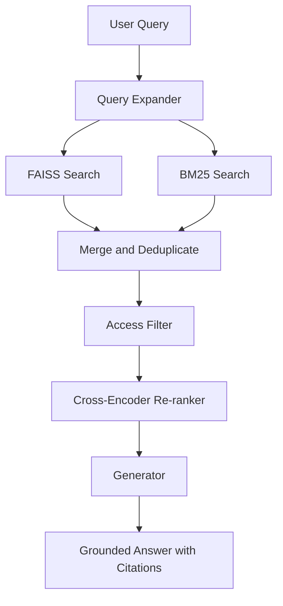

# PakLaw AI Project Report

## 1. Introduction

PakLaw AI is a Pakistani legal research assistant built for recall-critical search over public law documents and private firm documents. The system is designed to ground every answer in retrieved text so that the model does not rely on general knowledge or unsupported citation.

The project was organized as a phased build:

- environment and data setup
- public ingestion
- private ingestion
- hybrid retrieval
- grounded generation
- access control
- Streamlit UI
- evaluation scaffolding
- final documentation and cleanup

## 2. Problem Statement

Legal search systems fail when they miss exact section references, return semantically similar but irrelevant text, or leak restricted firm content across users. PakLaw AI addresses these problems with a hybrid retrieval pipeline, role-aware access control, and answer generation that only uses retrieved context.

## 3. Related Work

The project references the LawPal concept as a legal research assistant pattern, but the implementation here is constrained to the project rules in `docs/paklaw-ai-guidelines.md`.

Key design constraints:

- PyMuPDF for extraction
- LangChain recursive chunking
- FAISS + BM25 hybrid retrieval
- cross-encoder reranking
- Groq Llama 3 for generation
- Streamlit for the UI
- SQLite and bcrypt for user handling

## 4. System Architecture

PakLaw AI follows this pipeline:

### Core components

- `ingestion/extractor.py`, `ingestion/cleaner.py`, `ingestion/chunker.py`, `ingestion/tagger.py`, `ingestion/index_builder.py`
- `build_bm25.py`, `ingest_public.py`, `ingest_private.py`
- `query_expander.py`, `retriever.py`
- `prompts.py`, `generator.py`
- `access_control.py`
- `app.py`

## 5. Implementation Summary

### 5.1 Ingestion

Public corpus ingestion extracts text from PDFs, cleans noise, chunks the text, tags metadata, and builds both FAISS and BM25 indexes. Private ingestion reuses the same pipeline but stores indexes per firm under `indexes/firms/{firm_id}/`.

### 5.2 Retrieval

The retrieval layer expands a query into three phrasings, runs each query through FAISS and BM25, merges and deduplicates candidates, filters by access level and firm, and reranks candidates with a cross-encoder. The final output is the top 10 chunks.

### 5.3 Generation

The generator constructs a legal prompt with the fixed system instructions and retrieved context, then calls Groq to produce a cited answer. If no chunks are available, it returns the exact no-found sentence required by the guidelines.

### 5.4 Access Control

Access control is implemented with SQLite and bcrypt. The module stores usernames, password hashes, roles, and optional firm IDs, and it maps user roles to the correct index paths.

### 5.5 UI

The Streamlit app provides three tabs:

- Public Search
- Firm Vault
- Combined Search

The sidebar shows the current user, role, firm, and active corpus. Public search works without login. Firm vault features login and PDF upload. Combined search is restricted to partner-level access.

## 6. Evaluation Plan

The evaluation package is scaffolded in the repository:

- `eval/test_questions.md`
- `eval/results_paklaw.md`
- `eval/results_baseline.md`
- `eval/metrics.md`

These files define a 25-question set across constitutional, criminal, civil, family, and private-law domains, plus templates for logging retrieval outputs and calculating Precision@1, Precision@5, Precision@10, and MRR.

At the time of this report, the templates are prepared but the live retrieval runs and metrics values still need to be filled in.

## 7. Results

### 7.1 Current status

The codebase now contains working implementations for ingestion, retrieval, generation, access control, and UI.

### 7.2 Remaining validation work

To complete the evaluation section, the following still need to be done:

- run the 25-question evaluation set through PakLaw AI
- run the same questions through the BM25 baseline
- fill `eval/results_paklaw.md`
- fill `eval/results_baseline.md`
- compute the metrics table in `eval/metrics.md`

## 8. Conclusion

PakLaw AI now has the main product pipeline in place. The remaining work is operational evaluation and final polishing of the report PDF, demo delivery, and any documentation cleanup needed for submission.

## 9. Appendix: Demo and Test Artifacts

- Demo script: `demo/demo_script.md`
- Evaluation questions: `eval/test_questions.md`
- Evaluation results: `eval/results_paklaw.md`, `eval/results_baseline.md`
- Evaluation metrics: `eval/metrics.md`
